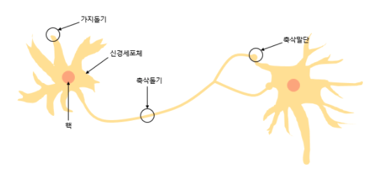
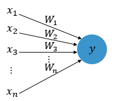
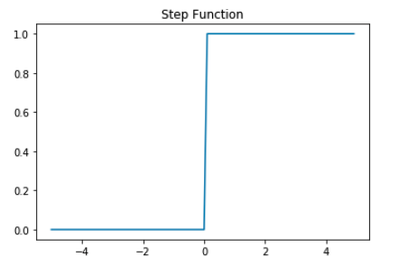
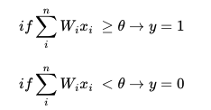
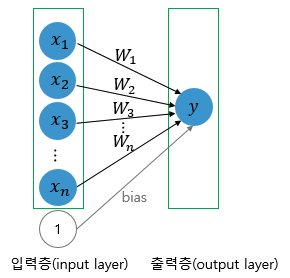
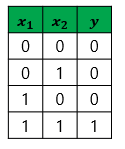
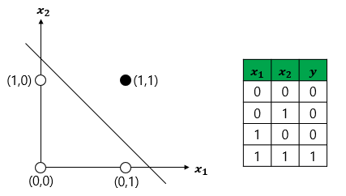
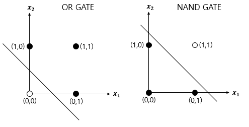
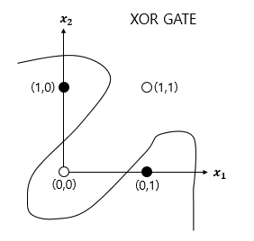

# 퍼셉트론(Perceptron)

위 사진은 뉴런 사진이다.
뉴런은 가지돌기에서 신호를 받아들이고, 이 신호가 일정치 이상의 크기를 가지면 축삭돌기를 통해서 신호를 전달합니다.

## 퍼셉트론 다중입력



$x$는 입력값, $W$ 는 가중치, $y$ 는 출력값

각각의 인공 뉴런에서 보내진 입력값 는 각각의 가중치 와 함께 종착지인 인공 뉴런에 전달되고 있습니다.

각각의 입력값에는 각각의 가중치가 존재하는데, 이때 가중치의 값이 크면 클수록 해당 입력 값이 중요하다는 것을 의미합니다.

## 계단함수



$\theta$ 는 임계치값
임계값을 넘는 값만 다음 뉴런으로 넘어가도록 한다.

## 단층 퍼셉트론(Single-Layer Perceptron)

단층 퍼셉트론은 값을 보내는 단계과 값을 받아서 출력하는 두 단계로만 이루어집니다. 



단층 퍼셉트론을 이용하면 AND, NAND, OR 게이트를 쉽게 구현할 수 있습니다

```python
def AND_gate(x1, x2):
    w1=0.5
    w2=0.5
    b=-0.7
    result = x1*w1 + x2*w2 + b
    if result <= 0:
        return 0
    else:
        return 1
```

AND 게이트를 충족하는 가중치와 편향값인 [0.5, 0.5, -0.7]에 -를 붙여서 [-0.5, -0.5, +0.7]을 단층 퍼셉트론의 식에 넣어보면 NAND 게이트를 충족합니다. 
```python
def NAND_gate(x1, x2):
    w1=-0.5
    w2=-0.5
    b=0.7
    result = x1*w1 + x2*w2 + b
    if result <= 0:
        return 0
    else:
        return 1
```

단지 같은 코드에 함수 이름과 가중치와 편향만 바꿨을 뿐입니다. 퍼셉트론의 구조는 같기때문입니다.

> OR_gate(x1, x2) 함수 작성해보기. 

 하지만 단층 퍼셉트론으로 구현이 불가능한 게이트가 있는데 바로 XOR 게이트입니다.




## 다층 퍼셉트론(MultiLayer Perceptron, MLP)


# 인공 신경망(Artificial Neural Network)
# Reference
> https://wikidocs.net/book/2155