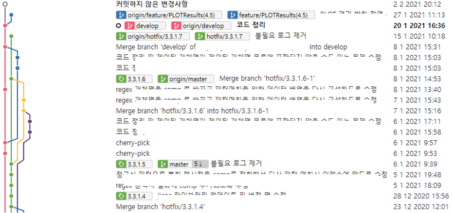

# 버전 관리 </a>

## Git
git 이 무엇인가?
## 버전 관리 Model

## Branch

#### **develop**
- 개발중인 브랜치

#### **master**
- 릴리즈가 되고 fix, tagging 되는 브랜치
- 해당 브랜치에서는 소스를 수정하지 않는다.

#### **feature**
- 기능 개발 브랜치로 기본적으로 develop에서 파생되는 브랜치
- 기능 개발이 완료되면 다시 develop으로 병합된다.
- 기능 개발이 길어지거나 소스 변경이 많은 프로젝트의 경우 develop브랜치를 수시로 병합해줘야 한다. (feature <- develop)
- develop 브랜치에 병합하는 것으로 기능 개발을 마무리한다. (feature -> develop)

#### **hotfix**
- 이미 릴리즈된 브랜치에서 버그가 발견되어 수정이 필요한 경우 사용되는 브랜치
- tag된 master 브랜치에서 파생되나, 버그 수정이 필요한 태그에서 파생되어야 한다.
- 0.0.0.X hotfix 된 버전을 올려 tagging 하고 브랜치 삭제.
- git-tool에 있는 ‘git flow의 hotfix 마무리’ 기능을 사용할 경우 develop에 까지 병합이된다. 하지만 다이퀘스트의 솔루션과 버전관리 방식에 맞지 않아 수동으로 진행해야 한다. ex) 3.2.0.3 hotfix 를 마무리하고자 하나 현재 develop은 3.5버전이 개발중이면, 그동안에 변경점과 기능 변경점이 많기 때문에 병합이 완벽한 병합을 보장하지 못한다. 때문에 develop에는 병합하지 않는다.

#### **release**
- release 브랜치는 develop에서 파생된다.
- 계획된 릴리즈 일정(기능 개발 등)에 맞춰 릴리즈를 하게 된다.
- 릴리즈는 릴리즈 시작, 테스트, 마무리 단계로 나뉜다.
- 릴리즈 시작
  - 기능 개발이 모두 완료되고 릴리즈를 시작한다.
  - 릴리즈를 말아서 배포한다.
- 테스트
  - 배포된 릴리즈를 테스트한다. (데이터분석팀)
  - 릴리즈 중에는 릴리즈 브랜치에 개발되거나 병합되는 기능(feature)은 없다.
  - 릴리즈 중에는 버그 fix만 한다.
  - 대략 일주일 정도 진행 된다.
- 릴리즈 마무리
- 개발일정 또는 사업 프로젝트 일정에 맞춰 릴리즈를 마무리한다.
- 릴리즈 브랜치는 master 브랜치와 develop 브랜치에 모두 반영된다. (release -> master, master -> develop)

*ex) ex1*

*ex) ex2*
 

## **[develop 브랜치]**

- 기본적으로 develop 브랜치는 현재 기능추가 및 개선 사항 등이 개발되는 브랜치입니다. 따라서, 현재 릴리즈가 **완료된 버전 4.4** 를 기준으로 한다면 **develop 브랜치는 현재로서는 예정된 4.5 버전**인 셈입니다. 사내 서버에 설치되어 운영 및 사용중인 버전은 테스트가 모두 완료된 4.4 버전입니다. 그러므로 현재 사용중인 사내 서버들에는 4.5 버전인 develop 브랜치를 반영하면 안됩니다.
  
- 기능 개발 및 개선에 대한 develop 브랜치의 배포 및 테스트는 DISA4 개발서버인 172.10.200.214 서버에서 이루어져야합니다.
  

## **[릴리즈가 완료된 버전의 버그 수정 방법]**
- 사내 서버 운영 및 사용 중(현재 4.4 버전)에 발견된 버그의 경우 hotfix 브랜치를 따서 수정해주셔야합니다.git에서 태그를 확인하시고 hotfix 버전이 제일 높은 버전에서 브랜치를 따서 수정하시고 배포하시면됩니다.4.4.0.x 태그에서 x가 hotfix 버전이고 제일 높은 버전이 4.4.0.2일 경우 해당 태그에서 브랜치를 hotfix/4.4.0.3 으로 따시고 버그 수정하시면 됩니다.

- 브랜치 마무리는 master 브랜치에 merge하시고 4.4.0.3 태그를 달면 됩니다.

- 브랜치를 따실때에는 현재 따려고하는 hotfix 버전이 열려있는지 확인하시고 열려있으면 열려있는 브랜치에서 버그를 수정하시면 됩니다.

- 수정된 버그가 develop에도 반영 되어야하는 버그라면, develop 브랜치를 checkout 하신 후 해당 커밋을 cherry-pick 하시면 됩니다.

- 해당 flow는 sourceTree gitFlow 기능을 이용하면 편하게 하실 수 있습니다.
 
- Hotfix 버전에서 수정되는 버그 수준은 라이브러리만 교체해도 사용가능한 수준입니다. 만약 버그자체가 라이브러리 교체 뿐만 아니라 설정이나 다른 솔루션에서의 소스수정, 리소스(사전) 변경 등이 필요한 수정이라면, 서서브버전 이상을 고려해야합니다.(4.4.x.0 에서 x) 이러한 수정의 경우 팀장님과 팀원과 회의를 통해 결정되는게 좋습니다.

- 참고될만한 url 남겨드립니다. (http://amazingguni.github.io/blog/2016/03/git-branch-%EA%B7%9C%EC%B9%99)

# REFERENCE
> [A successful git branching model](http://dogfeet.github.io/articles/2011/a-successful-git-branching-model.html) - Vincent Driessen